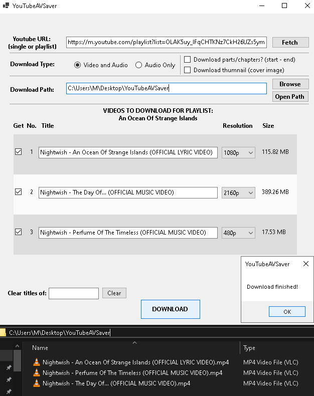
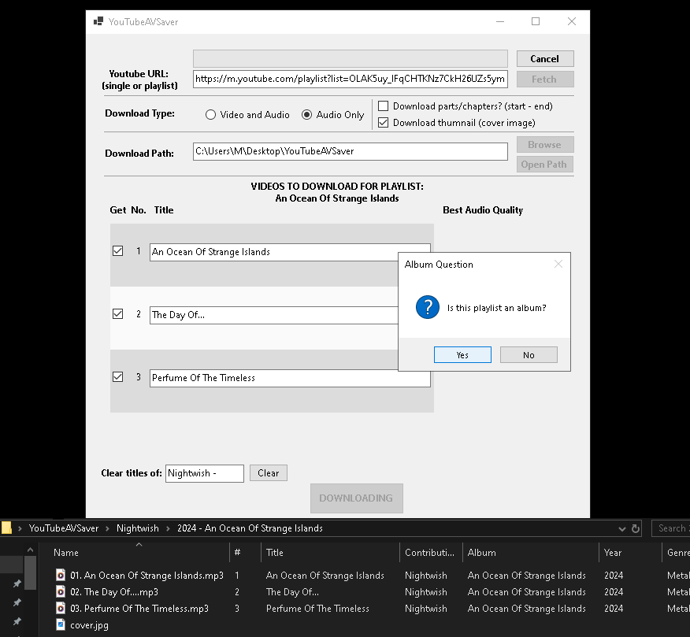
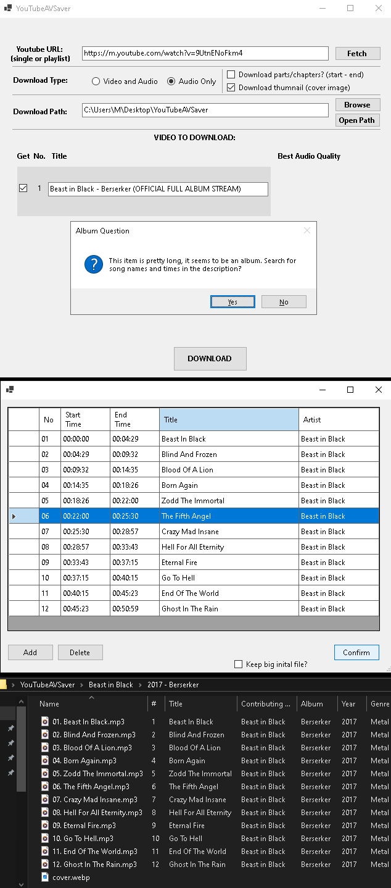

# YouTubeAVSaver
YouTubeAVSaver is a Windows Forms application that allows users to download YouTube video and audio in various formats. 
You can download entire playlists or individual videos, with options for full video downloads or chapter-based segments. 
The app also supports downloading and tagging audio albums from playlists or large single files.

## Download
- **Release: (https://github.com/ion33l/YouTubeAVSaver/releases/latest)**
- **Unzip the archive into a new folder and run the YouTubeAVSaver.exe file located inside.**

> **Note**:
> **YouTubeAVSaver** comes bundled with [FFmpeg](https://ffmpeg.org) which is used for processing videos.

## Features

- **Download videos by URL**
- **Download videos from playlists**
- **Selectable video quality**
- **Album Support for Audio:** Adding of tags for the MP3 files when downloading albums
- **Download chapters for video or songs for audio:** For audio only, the app can look into the URL description and detect songs. If not found, the user can add them manually in a dedicated form, before downloading.

## Screenshots
- **Video and Audio from Playlist:**

- **Audio Only from Playlist:**

- **Audio Only from Single URL:**
